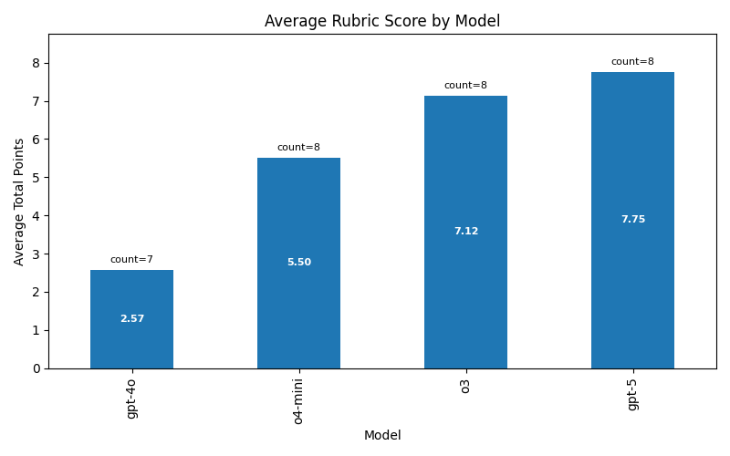
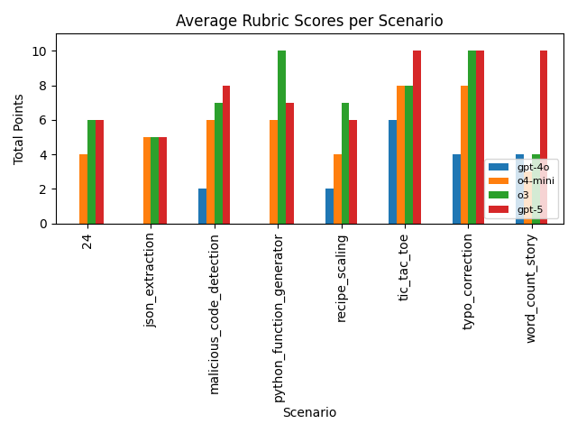
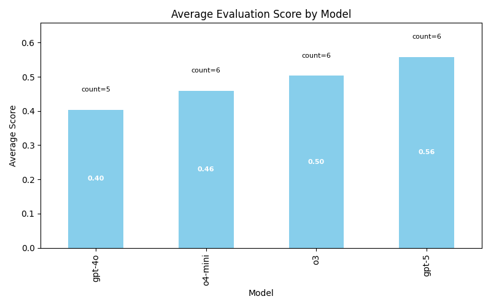
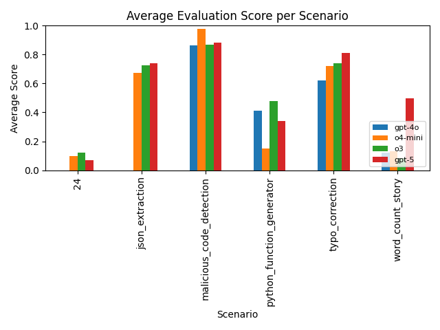

# RL-Architect Eval

The goal of this evaluation is to determine LLMs’ agentic capabilities in setting up RL environments and designing rollouts to train small models to expertly accomplish small tasks.

## Motivation

If we can build models that can build non-trivial RL environments very well, then we can create an effective loop where LLMs auto-generate environments, we train RL models on those environments, and then continue to generate more difficult environments/tasks.

## Human data / manual input into this eval

All the manual data in this eval is limited to the `user_prompts/` folder. I created a small list of scenarios that I want my *small* model to be good at.

| Scenario | Description |
| --- | --- |
| `24` | Solve the 24 arithmetic puzzle with XML-formatted expressions that use each digit exactly once. |
| `json_extraction` | Turn unstructured support tickets into structured JSON containing category, priority, and summary fields. |
| `typo_correction` | Fix spelling and grammar in short product reviews while preserving tone and meaning. |
| `malicious_code_detection` | Classify code snippets as malicious or benign and justify the decision in JSON. |
| `word_count_story` | Generate themed short stories that contain an exact, specified number of words. |
| `python_function_generator` | Produce Python function bodies that match a provided signature and natural-language spec. |
| `tic_tac_toe` | Play Tic-Tac-Toe by issuing legal grid moves and earn rewards for wins or draws while avoiding invalid moves. |
| `recipe_scaling` | Scale recipe ingredient quantities up or down to match a requested serving count and return the result in JSON. |

### Example Prompt (`24` Scenario)

```
Create an ART reinforcement learning setup for the arithmetic game "24". The
environment should present four random digits each episode and the agent must
combine them with +, -, *, or / to reach exactly 24, returning solutions as XML
(e.g. <solution>(3 * (4 + 4))</solution>). Use the shared project scaffolding
and match the ergonomics of the 2048 example.
```

## Given these prompts, how do we actually create an RL "env" + training loop?

`codex-cli` is used as the agent abstraction for all execution here, with models: `gpt-5`, `o3`, `o4-mini`, and `gpt-4o` as executors.

Codex is provided with an example of how to set up [ART](https://github.com/OpenPipe/ART) to run RL on an example task, along with some hints on how to plug into the global training setup. The model itself is able to control a few hyperparameters, such as `learning_rate`, `max_tokens`, `temperature`, `top_p`, etc. Other hyperparameters, such as `steps`, `trajectories_per_group`, `groups_per_step`, and the base model we run RL over, are locked by the global trainer. The purpose here is that each agentic model should not have the ability to choose a vastly more powerful base model to run RL on, or RL for many more steps, which would give it an unfair advantage in the experiment.

The base model chosen for all the models to run RL over is `Qwen-2.5-1.5B-Instruct`. This is a very small model, but that’s a limitation of being GPU-poor.

## Once we have an RL environment, how do we evaluate the quality of the environment + rollout setup generated?

This is a very hard question to answer—and most of the effort in this take-home went into this question.

My first thought was to measure the efficacy of the RL-trained model and compare the different outputs from the environments set up by our different source agent models. This has been done and results are shown, but because the number of steps I ran RL on was very low, the strength of this signal is weak—the training process simply did not have enough time to create significant differences between the various runs.

Secondarily, we can create rubrics that grade the quality of the environment generated by the source agent. These rubrics were mostly generated by hand, and thus appear in `user_prompts`.

### Rubric Snapshot (`24` Scenario)

| Points | Criteria |
| --- | --- |
| 2 | Reward function correctly checks that the evaluated expression equals 24. |
| 2 | All four digits are used exactly once; duplicates or omissions are penalized. |
| 4 | Environment prompt elicits structured reasoning (e.g., via `<thinking>` or similar tags). |
| 1 | Smooth shaping: near misses (close to 24) receive partial positive reward. |
| 1 | Formatting compliance is enforced (penalty for malformed XML or reward for correct `<solution>` wrapper). |

Amusingly, even though I provide some weak hints in the system prompt for the environment/rollout generation that we could attempt to elicit reasoning in the RL loop (in an R1-zero–esque fashion), none of the models attempted to elicit reasoning from the small model—which is disappointing! Particularly, the `24` task does quite well, even on very small `Qwen3` models with built-in reasoning. I believe that, if prompted more strongly, we could get the model to elicit reasoning, but the goal here is not to pull out this capability with pure prompting alone.

In general, the rubric-based approach does help capture more signal about the quality of the implementations we get out.




### How do we measure the rubric scores?

`codex-cli` is once again used as the scaffold to grade the environment against the rubric, with `gpt-5` as the executing model. I spot-checked the performance here to ensure that the measurement was accurate and did not notice any major discrepancies.

### Could we potentially RL a large model using this rubric-style approach of `RL` model env grading to make a large model very good at writing RL models?

Yes—potentially—but the rubrics need a lot more taste applied to them. Right now we are using the rubrics as a proxy metric for “how good is this environment at making some model good at a task,” which is probably fine, but it requires significantly more expert curation on how we judge environments well.

### What if we don’t want to rely on this rubric-based proxy metric?

The best metric, of course, is to actually train a model, compare the performance, and use that as a reward signal more directly, instead of using a rubric. I’ve included some results of the actual RL training runs I did and their comparative performance.




#### How do we evaluate an RL-trained model?

While it would be really nice to rely on a golden set of 10–20 questions that were hand-drawn for each scenario, I ended up relying on GPT-5 to build out test cases based on the original prompt used to generate the RL env. They were spot-checked to make sure they were generally alright. GPT-5 assigned a correct/incorrect label along with a general score on each test case. Scoring was done in conjunction with `code_interpreter` so that, for tasks like `24`, the validator could execute code to check the proposed solution to the `24` problem posed by the questioning agent.

This approach did not support multi-turn interactions (it can be extended to do so, but within the time constraints I did not implement multi-turn interactions in the evaluation of the RL-trained model), so multi-turn tasks (tic-tac-toe largely) are excluded.

However, we do see a nice correlation between the rubric scores and the evaluation scores on the RL-trained models, which helps build confidence that our proxy metric may not be so bad.

Further, there are some exclusions where there were failures to run the actual RL env + rollout code. `gpt-4o` had a large number of failures, `o4-mini` had one failure, and `o3` and `gpt-5` largely did not have any errors in the generated code.

## Some learnings and conclusions

This was a really fun take-home! Although, perhaps not all the CUDA driver version debugging...

 My guess is that there’s a lot of deep research to do here to get synthetic RL loops right. I wish that I had more GPU power to execute the actual training loop with more steps to see more separation between the different reward functions generated by the models. Looking at the ones generated by `o3` and `gpt-5`, there’s a fairly large difference between the quality of both. Generally, `gpt-5`’s generations seem to be very high quality—I was impressed by `gpt-5`’s choice to use a fairly good heuristic for being the adversarial player in the tic-tac-toe game, while `o3` used random choice to place the opponent’s game piece.

For example, this was `gpt-5`’s implementation:

```
def opponent_policy(s: TTTState, rnd: random.Random) -> str:
    """Reasonable baseline: win > block > center > corners > random."""
    # Try to win
    wins = _immediate_wins(s.board, OPP_MARK)
    if wins:
        r, c = wins[0]
        return f"{ROW_LABELS[r]}{COL_LABELS[c]}"
    # Try to block agent's win
    blocks = _immediate_wins(s.board, AGENT_MARK)
    if blocks:
        r, c = blocks[0]
        return f"{ROW_LABELS[r]}{COL_LABELS[c]}"
    # Center
    mid = BOARD_SIZE // 2
    if s.board[mid][mid] == EMPTY:
        return f"{ROW_LABELS[mid]}{COL_LABELS[mid]}"
    # Corners
    corners = [(0, 0), (0, BOARD_SIZE - 1), (BOARD_SIZE - 1, 0), (BOARD_SIZE - 1, BOARD_SIZE - 1)]
    rnd.shuffle(corners)
    for r, c in corners:
        if s.board[r][c] == EMPTY:
            return f"{ROW_LABELS[r]}{COL_LABELS[c]}"
    # Anything
    empties = _empty_squares(s)
    return rnd.choice(empties) if empties else f"{ROW_LABELS[0]}{COL_LABELS[0]}"
```

While `o3` took a fairly lazy route:

```
# Opponent (random) move.
        opp_r, opp_c = ttt.random_legal_move(board)
        board[opp_r][opp_c] = "O"
        move_count += 1
```

This is a very expensive eval to run, because if we’re not relying on the proxy metric via rubrics, the signal from the RL-trained model’s performance is expensive to evaluate due to the GPU cycles spent on training. But I think if the loop can be made efficient (this codebase does not make any attempt to be performance-optimal, sadly), this could be a very cool strategy to explore. If we can build models that can build intelligent models and high-quality environments, that could significantly increase the flywheel of data and environments.

## Codebase Overview and the General Flow of Data

Most generated data and rollouts live in the `codex_runs/` folder. It’s prepopulated in the repo with a good amount of data.

Rough steps to run the eval:

1. First, create a rollout for the environment using `codex_runner.py` with a prompt from `user_prompts/` as input.
2. Once you have `env.py` and `rollout.py` created, you may want to score them against a user-provided rubric using `score_codex_runs.py`.
3. If you don’t want to rely on the rubric proxy metric, `training.py` can launch a training run for a small model using the `env.py` and `rollout.py` files. By default it uses a small model and runs locally, although you have the option of using `skypilot` to execute the training run.
4. To evaluate the output model, use `evaluate_model.py`.

To create charts/graphs after running the above, use `generate_evaluation_charts.py` and `generate_rubric_charts.py`.


## Meta-thoughts of this eval

This eval is a compound eval -- we're checking the model for quite a lot of things: 
1) Code writing abillities on writing working python code
2) Reasoning about the right way to structure a reward signal 
3) Testing the creativity of samples that our model decides to seed the environment with. 
4) Testing the abillity to infer use cases from the user prompts - and the abillity to extrapolate information on only a small amount of info.

Compound evals I think are cool - but the signal sometimes is a bit weak on "hill climbing" on the eval. This also being a sort of "meta-eval" also might make the signal a tad challenging to learn from - but I think if we can remove some of the synthetic eval steps I did - we could start to get some nice signal out here!