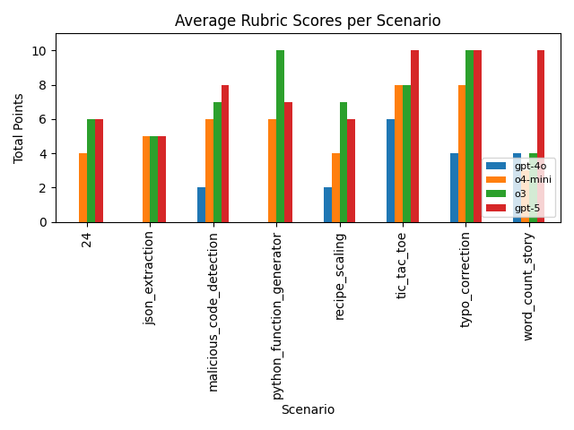
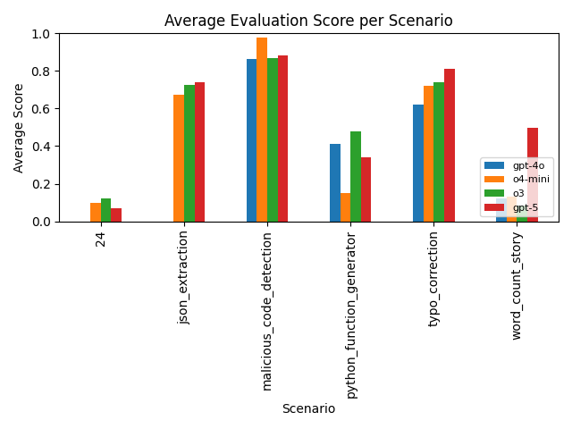

(this file was the input to codex to help clean up spelling + grammar - preserved for posterity :) ) 

# RL-Architect Eval
The goal of this evaluation is to determine LLM's agentic capabilities in setting up RL environments and rollout design in training small models to expertly accomplish some small task. 
## Motivation
If we can build models that can build RL environments very well, that are non trivial - then we can create an effective loop where LLMs auto generate environments, we RL models on that environment, and then continue to generate more difficult environments/tasks. 

## Human data / manual input into this eval
All the manual data in this eval is limited to the `user_prompts/` folder. I created a small list of scenarios that I want my *small* model to be good at. 

| Scenario | Description |
| --- | --- |
| `24` | Solve the 24 arithmetic puzzle with XML-formatted expressions that use each digit exactly once. |
| `json_extraction` | Turn unstructured support tickets into structured JSON containing category, priority, and summary fields. |
| `typo_correction` | Fix spelling and grammar in short product reviews while preserving tone and meaning. |
| `malicious_code_detection` | Classify code snippets as malicious or benign and justify the decision in JSON. |
| `word_count_story` | Generate themed short stories that contain an exact, specified number of words. |
| `python_function_generator` | Produce Python function bodies that match a provided signature and natural-language spec. |
| `tic_tac_toe` | Play Tic-Tac-Toe by issuing legal grid moves and earn rewards for wins or draws while avoiding invalid moves. |
| `recipe_scaling` | Scale recipe ingredient quantities up or down to match a requested serving count and return the result in JSON. |

### Example Prompt (`24` Scenario)

```
Create an ART reinforcement learning setup for the arithmetic game "24". The
environment should present four random digits each episode and the agent must
combine them with +, -, *, or / to reach exactly 24, returning solutions as XML
(e.g. <solution>(3 * (4 + 4))</solution>). Use the shared project scaffolding
and match the ergonomics of the 2048 example.
```

## Given these prompts, how do we actually create an RL "env" + training loop?

`codex-cli` is used as the agent abstraction for all execution here, with models: `gpt-5`, `o3`, `o4-mini`, and `gpt-4o` as executors. 

Codex is provided with an example of how to setup [ART](https://github.com/OpenPipe/ART) to RL on a example task along with some hints on how to plug into the global training setup. 
The model itself is able to control a few hyperparameters, such as `learning_rate`, `max_tokens`, `temperature`, `top_p`, etc. Other hyper parameters, such as `steps`, `trajectoriers_per_group`, `groups_per_step`, and the base model we RL over are locked by the global trainer. The purpose here is that each agentic model should not have the abillity to choose a vastly more powerful base model to RL on, or RL for many more steps that would give it an unfair advantage in the experiment. 

The base model chosen for all the models to RL over is `Qwen-2.5-1.5B-Instruct`. This is a _very_ small model, but this is just a limitation of being GPU poor. 

## Once we have an RL environment, how do evaluate the quality of the environment + rollout setup generated?
This is a very hard question to answer - and most of the effort in this take home went into this question. 

My first thought is that I should measure the efficacy of the RLed model, compare the different outputs from the environments setup by our different source agent models. This has been done and results are shown, but becasue the number of steps I RLed on was _very_ low, the strength of this signal is weak, because the training process flat out did not have enough time to actually create significant delta between the various runs.

Secondarily, we can create rubrics that grade the quality of the environment generated by the source agent. These rubrics were mostly generated by hand, and thus appear in `user_prompts`. 

### Rubric Snapshot (`24` Scenario)

| Points | Criteria |
| --- | --- |
| 2 | Reward function correctly checks that the evaluated expression equals 24. |
| 2 | All four digits are used exactly once; duplicates or omissions are penalized. |
| 4 | Environment prompt elicits structured reasoning (e.g., via `<thinking>` or similar tags). |
| 1 | Smooth shaping: near misses (close to 24) receive partial positive reward. |
| 1 | Formatting compliance is enforced (penalty for malformed XML or reward for correct `<solution>` wrapper). |

Funnily enough, even though I provide some *weak* hints in the system prompt in the environment/rollout generation that we could attmept to elicit reasoning in the RL-loop (in a R1-zero-esque) fashion, none of the models attempted to elicit reasoning out of the small model - which is kind of disappointing! Particularly, the `24` task does quite well, even on very small `Qwen3` models with the in built reasoning. I believe if prompted more strongly - we could get the model to try and elicit reasoning, but the goal here is not to pull out this capability with just pure prompting. 

In general, the rubric based approach does help capture more signal in the quality of the implementations we get out.




### How do we measure the rubric scores?

`codex-cli` is once again used as the scaffold to grade the environment on the rubric with `gpt-5` as the executing model. I spot checked the performance here to ensure that the measurement was accurate, and did not notice any major discrepancies.

### Could we potentially RL a large model using this rubric style approach of `RL` model env grading to make a large model very good at writing RL models?

Yes - potentially - but the rubrics need a lot more _taste_ applied to them. Right now we are using the rubrics as a proxy metric for "how good is this environment at making _some_ model at a task" - which is _probably_ fine, but requires significant more expert curation on how we judge environments well. 

### What if we don't want to rely on this rubric based proxy metric?

The best metric here, of course, is to actually train a model, compare the performance, and use that as a reward signal - more directly, instead of using a rubric. I've included some results of the actual RL-train runs I did and the comparative performance of them.



#### How do we eval an RLed model?

While it would be really nice to rely on a golden set of 10-20 question that were hand drawn for each scenario, I ended up relying on GPT-5 to build out test cases based on the original prompt that we used to generate the RL env. They were spot checked to make sure that they were generally alright. GPT-5 assigned a correct / incorrect label along with a general score on that test case. Scoring was done in conjection with `code_interepreter` so that for tasks like `24` the validator could execute code to check the proposed solution to the `24` problem posed by the questioning agent.

This approach did not support multi-turn interactions (it can be extended to do so, but in the time constraints, I did not implement multi-turn interactions in the eval of the RLed model) - so multi turn tasks (tic-tac-toe largely) is excluded.

However, we do some nice correlation here between the `rubric` scores and the `eval` scores on the `RLed` models which is really nice as it helps build some confidence that maybe our proxy metric is not so bad!

Further, there are some exclusions on where there were failiures to run the actual RL env + rollout code, `gpt-4o` had a large chunk of failiures, `o4-mini` had 1 failiure, `o3`, and `gpt-5` largely did not have any errors in the actual generated code.

## Some learnings and conclusions

This was a really fun take home! My guess is that there's probably a lot of *deep research* to do here - to get synthetic-RL-loops correct. I with that I had more GPU power to execute the actual training loop with more steps - to see more space open up between the different reward functions generated by the models. Taking a look at the ones generated by `o3` and `gpt-5` there's a fairly large difference between between the quality of both. Generally `gpt-5`'s generation seem to be very high quality - I was impressed by `gpt-5`'s choice to use a fairly good heuristic for being the adversaerial player in the game, while `o3` used random choice to place the opponent's game piece. 

For example, this was `gpt-5`'s implementation: 
```
def opponent_policy(s: TTTState, rnd: random.Random) -> str:
    """Reasonable baseline: win > block > center > corners > random."""
    # Try to win
    wins = _immediate_wins(s.board, OPP_MARK)
    if wins:
        r, c = wins[0]
        return f"{ROW_LABELS[r]}{COL_LABELS[c]}"
    # Try to block agent's win
    blocks = _immediate_wins(s.board, AGENT_MARK)
    if blocks:
        r, c = blocks[0]
        return f"{ROW_LABELS[r]}{COL_LABELS[c]}"
    # Center
    mid = BOARD_SIZE // 2
    if s.board[mid][mid] == EMPTY:
        return f"{ROW_LABELS[mid]}{COL_LABELS[mid]}"
    # Corners
    corners = [(0, 0), (0, BOARD_SIZE - 1), (BOARD_SIZE - 1, 0), (BOARD_SIZE - 1, BOARD_SIZE - 1)]
    rnd.shuffle(corners)
    for r, c in corners:
        if s.board[r][c] == EMPTY:
            return f"{ROW_LABELS[r]}{COL_LABELS[c]}"
    # Anything
    empties = _empty_squares(s)
    return rnd.choice(empties) if empties else f"{ROW_LABELS[0]}{COL_LABELS[0]}"
```
While `o3` took a fairly lazy route: 
```
# Opponent (random) move.
        opp_r, opp_c = ttt.random_legal_move(board)
        board[opp_r][opp_c] = "O"
        move_count += 1
```

This is a *very* expensive eval to run, becasue if we're not relying on the proxy metric via rubrics, the signal of the `RL`-ed model's performance is expensive to evaluate because of the GPU cycles spent on training. But I think if the loop can be made efficient (this code base does not make any attempt to be performance optimal, sadly), this could be a very cool strategy to explore on, if we can build models that can build intelligent models / high quality environments, that could siginificnalty increase the fly wheel of data / environments.

## Codebase overview and the general flow of data

Most generated data / rollouts all live in the `codex_runs` folder. It's prepopulated in the `git` repo with a good chunk of data. 

Rough steps to run the eval: 

1. First create a rollout for the actual environment using `codex_runner.py` and a `user_prompt` as an input. 
2. Once you have a `env.py` and `rollout.py` file created - you may want to score it against a user provided rubric using `score_codex_runs.py`
3. If you don't want to rely on the proxy metric of a rubric, `training.py` can launch a training run for a small model using the `env.py` and `rollout.py` files. By default it uses a small model and runs locally - although you have the option of using `skypilot` to execute the training run. 
4. To evaluate the output model, you can utilize the script `evaluate_model.py`. 

To create charts / graphs after running all the above, you can use the `generate_evaluation_charts.py` and `generate_rubric_charts.py`. 